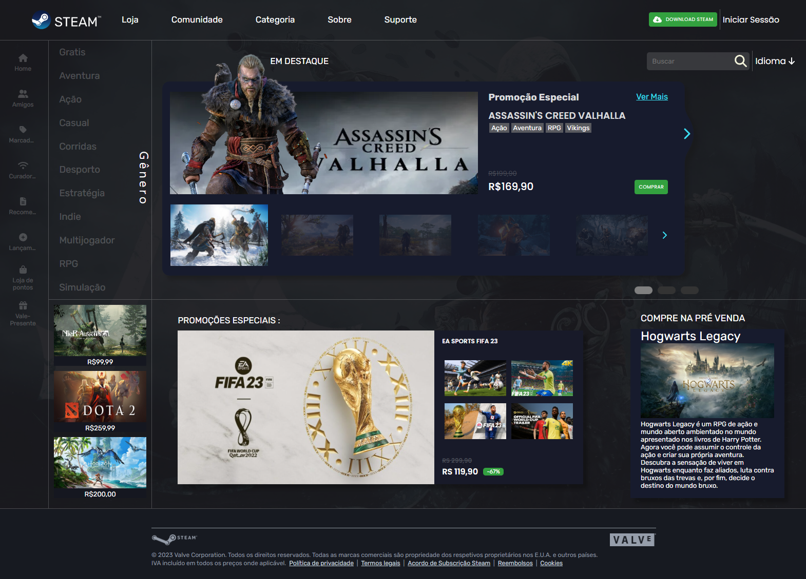

<h1 align="center">
	# Steam Layout
</h1>

# About the project
O projeto consiste na criação de uma página web baseado no design de Camile Toscano - https://www.linkedin.com/in/camiletoscano/.

# Technologies
- ReactJs in class
- React Router DOM
#


<h1 align="center">
	
</h1>
<h1 align="center">
	Project
</h1>
<h1 align="center">
	
</h1>

Requirements
- npm

**Clone the project and access the folder**

```bash
git clone https://github.com/DouglasANS/Steam-Layout.git  
```
&&
```bash
cd Steam-Layout
```

**Follow the steps below**

```bash
# Install the dependencies
$ npm install

# To finish, run the application
$ npm start

# Well done, project is started!
```
